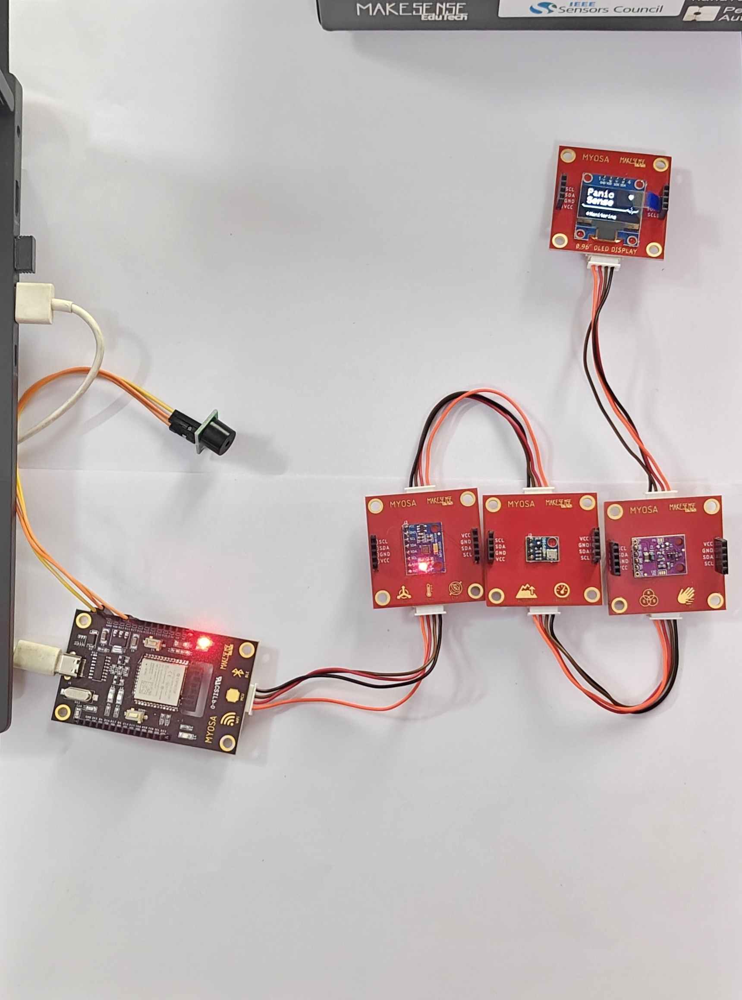
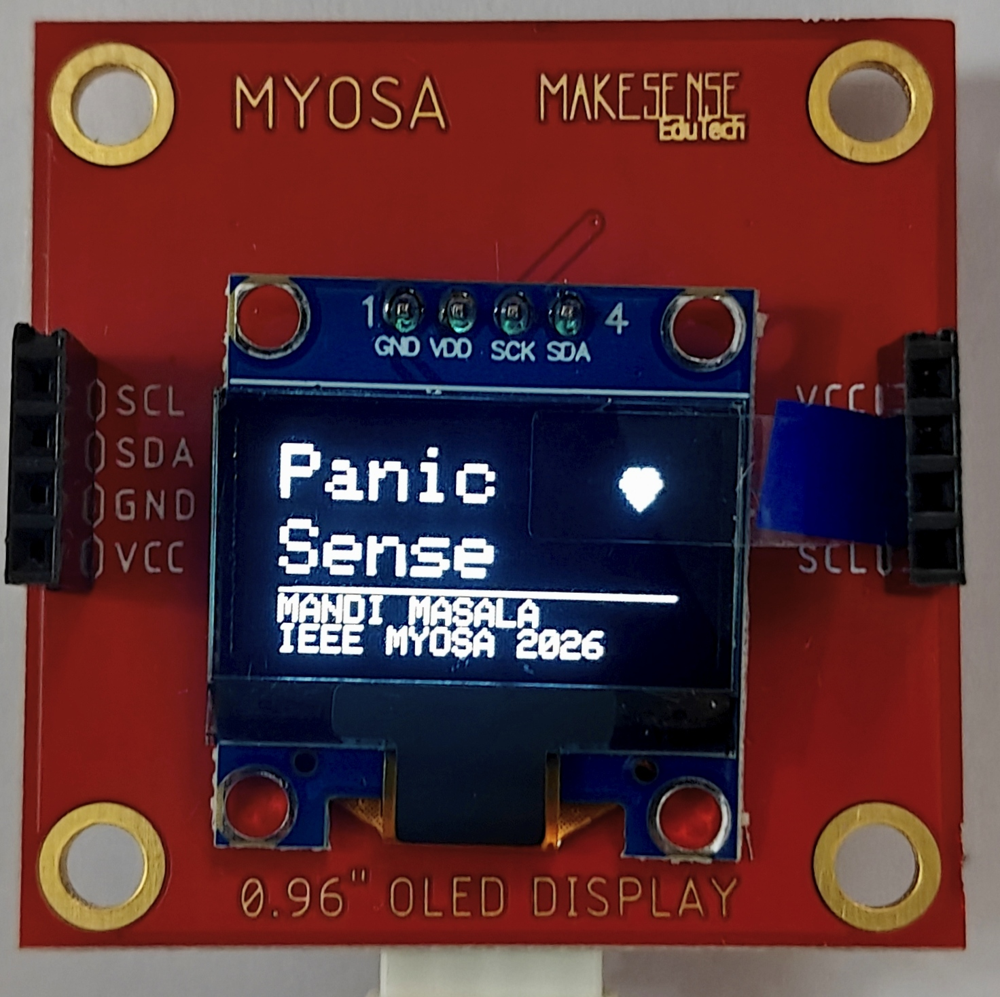
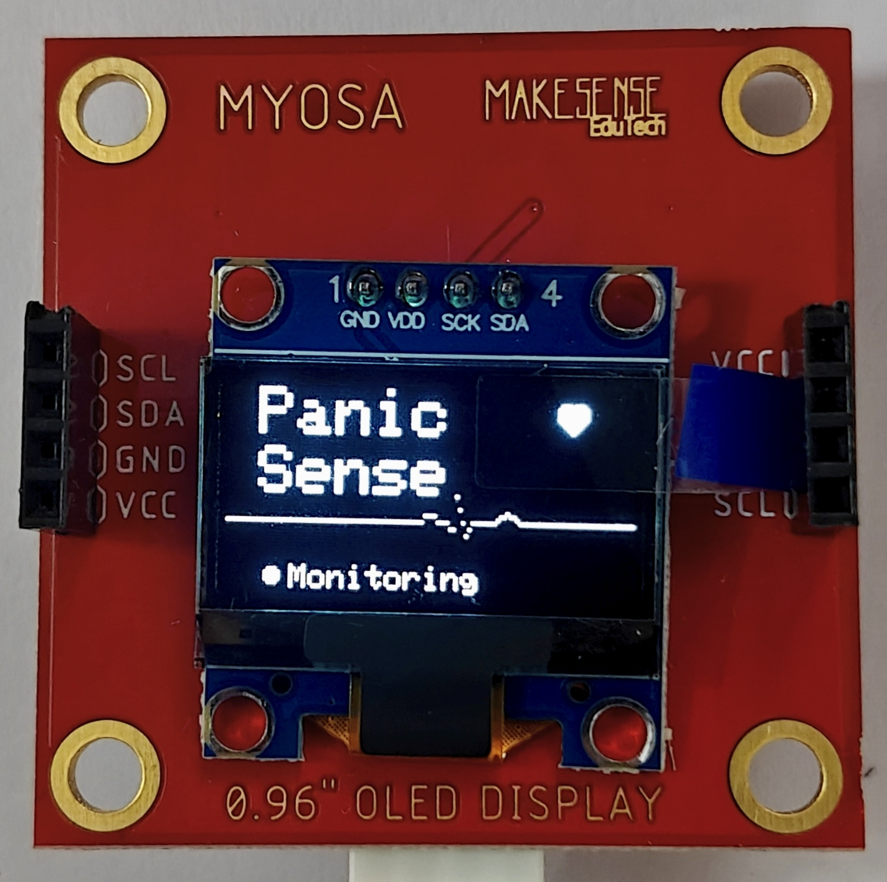
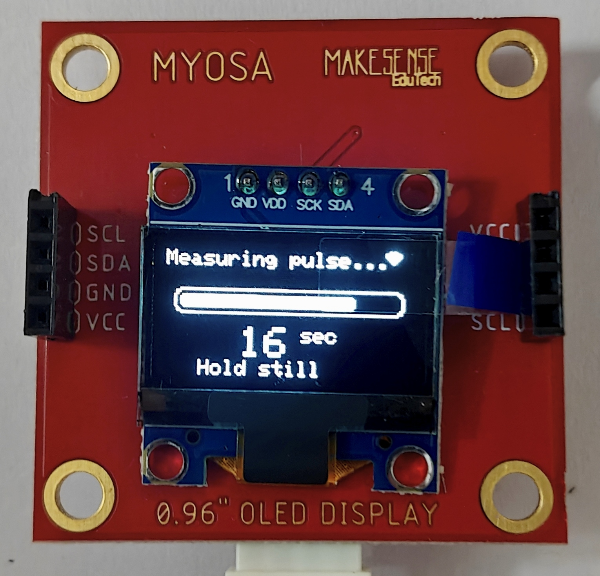
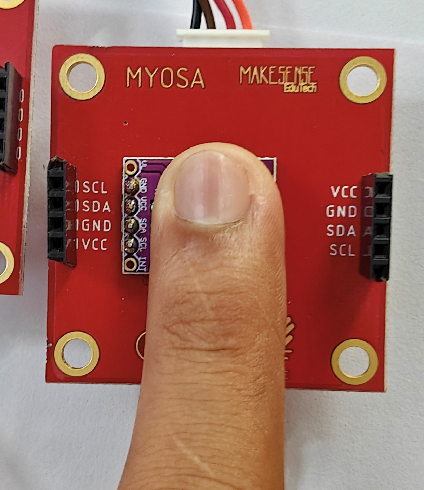
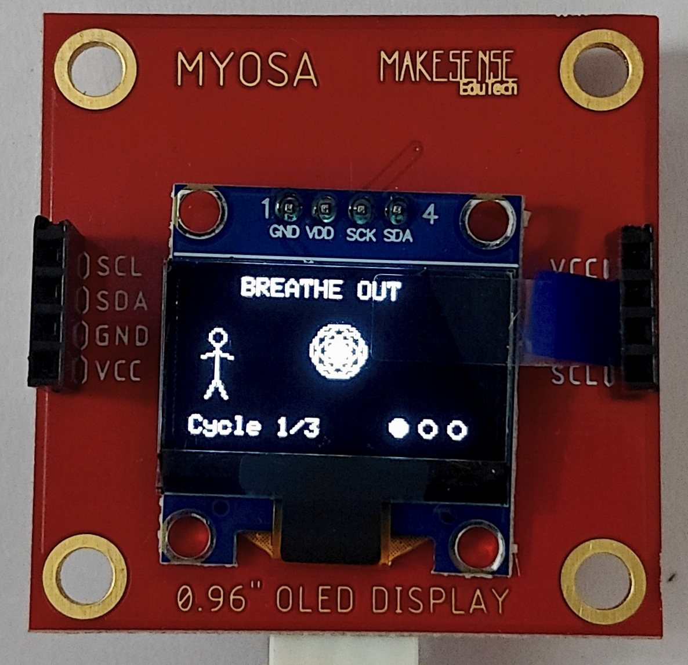
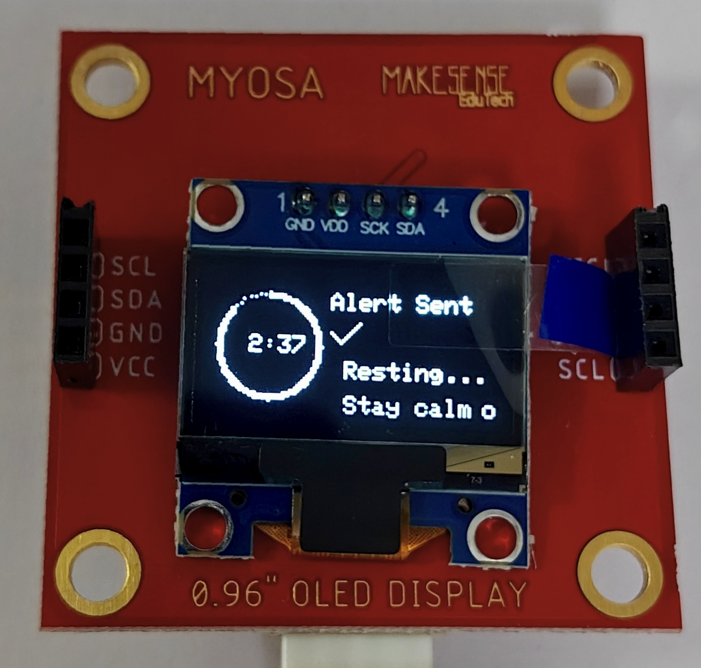
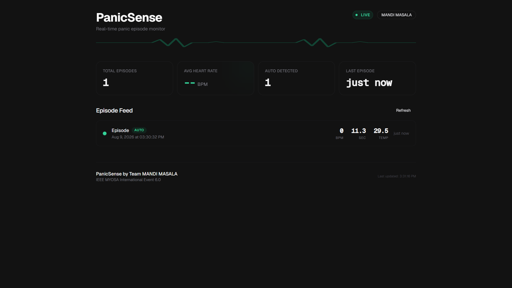

# PanicSense

🕒 August 2026 — PanicSense

A wrist-worn panic attack detection and guided de-escalation device built on the MYOSA Mini IoT Kit.

---

## Overview

PanicSense is a wearable IoT device that passively detects the physical signature of a panic attack and responds in real time — without requiring the wearer to press a button or reach for a phone.

The device runs on the MYOSA Mini IoT Kit (ESP32) and uses a five-state firmware state machine to continuously monitor hand tremor via the MPU6050 accelerometer. When sustained tremor is detected, the APDS9960 sensor is repurposed as a basic photoplethysmography (PPG) pulse sensor to confirm an elevated heart rate as a second independent signal. Only when both signals agree does the device act — eliminating false positives from everyday motion.

Once an episode is confirmed, the OLED display launches a guided box-breathing animation to help the wearer de-escalate. Simultaneously, an alert is dispatched over WiFi to a real-time React dashboard, where episode data including barometric pressure and temperature from the BMP180 are logged and visualized. An active buzzer provides haptic-style audio confirmation that the alert was sent.

The core safety path works fully on-device with no cloud dependency. A Gemini AI layer optionally enriches the alert message to the trusted contact when internet connectivity is available.

**"Detect. Breathe. Alert." — Panic attack detection that works before the wearer can ask for help.**

---

## Key Features

- Passive tremor detection using MPU6050 rolling-variance algorithm — no user input required
- Creative APDS9960 repurposing as a PPG pulse sensor, beyond its documented spec
- Two-signal confirmation (tremor + pulse) before any alert fires — structural false-positive elimination
- OLED guided box breathing pacer (4s inhale, 4s hold, 4s exhale, 4s hold — 3 cycles)
- Real-time React dashboard receiving live episode alerts over WiFi
- BMP180 barometric pressure and temperature logging per episode
- BLE fallback alert path if WiFi is unavailable
- On-device SPIFFS episode storage — up to 50 episodes survive reboot
- NTP-synced episode timestamps (IST, UTC+5:30)
- Five-minute cooldown after each episode to prevent alert spam
- Active buzzer alert confirmation (3 beeps, non-blocking via millis())
- Fully non-blocking firmware — zero delay() calls in the main loop

---

## Demo / Examples

### Images


*Complete PanicSense prototype — MYOSA motherboard with MPU6050, APDS9960, BMP180, OLED, and buzzer connected via JST daisy chain*


*Boot splash screen — Team MANDI MASALA, IEEE MYOSA 2026*


*IDLE state — PanicSense monitoring with animated heartbeat line*


*CONFIRMING state — "Measuring pulse..." with progress bar and countdown timer*


*Finger placed on APDS9960 sensor window for PPG-based pulse confirmation*


*EPISODE_ACTIVE state — Guided box breathing pacer, Cycle 1/3, expanding circle animation*


*COOLDOWN state — Alert confirmed sent, circular countdown timer, "Stay calm" message*


*Real-time React dashboard — live episode feed, BPM, temperature, auto-detection status*

### Video

[Demo Video](panicsense-demo.mp4)

---

## Features (Detailed)

### Tremor Detection (MPU6050)
The MPU6050 accelerometer is sampled every 100ms using millis()-based non-blocking timing. A rolling window of 10 magnitude readings computes variance across X, Y, and Z axes. Tremor is confirmed only when variance exceeds the threshold (0.15 g²) across 3 consecutive windows (300ms sustained) — filtering out single-spike false triggers from bumps, taps, or typing.

### Pulse Confirmation — Creative APDS9960 Repurposing
The APDS9960 is marketed as a gesture, proximity, and ambient light sensor. PanicSense repurposes its onboard IR LED and photodiode as a basic PPG sensor — the same physical principle used in smartwatch heart rate monitors, but applied to a sensor never designed for biometric sensing. When the wearer places a finger over the sensor window, the proximity register modulates with the pulse waveform. A peak-detection algorithm running over 500 samples extracts BPM. This creative platform exploitation beyond documented spec is central to the MYOSA judging rubric.

### Two-Signal Confirmation
An alert fires only when tremor AND elevated pulse (BPM > 100) both confirm simultaneously, or when the wearer manually swipes the APDS9960 gesture sensor as an instant SOS override. No single-sensor false positive can trigger an alert. This is a structural, not threshold-based, solution to the false-alarm problem.

### OLED Guided Breathing Pacer
Once an episode is confirmed, the OLED transitions to a full-screen box-breathing animation: expanding and contracting circle with INHALE / HOLD / EXHALE / HOLD labels, a stick figure visual, and a cycle progress indicator (Cycle 1/3, 2/3, 3/3). Three complete cycles run in approximately 48 seconds.

### WiFi Alert and React Dashboard
After breathing completes, the ESP32 HTTP POSTs a JSON payload to the React dashboard containing episode timestamp (NTP-synced), BPM estimate, tremor duration, barometric pressure, and temperature. The dashboard displays a live episode feed, running stats, and a real-time waveform graph. BLE advertising runs in parallel as a fallback path.

### BMP180 Contextual Logging
The BMP180 barometric pressure sensor logs pressure (hPa) and temperature (°C) at the moment of each episode. Research links barometric pressure drops to increased anxiety and migraine events. The dashboard plots this data against episode history, surfacing personal weather-linked patterns over time.

### SPIFFS On-Device Episode Storage
Up to 50 episodes are stored in ESP32 SPIFFS flash memory. Episodes persist across reboots and sync to the dashboard on reconnect. Oldest episodes are deleted on overflow in a circular log pattern.

---

## Usage Instructions

1. Connect all four MYOSA sensor boards to the motherboard via JST daisy chain (MPU6050 → APDS9960 → BMP180 → OLED)
2. Connect buzzer: GND to GND, 5V to VIN, SIG to D26 on the GPIO header
3. Edit `panicsense/config.h` — set WIFI_SSID, WIFI_PASS, and DASHBOARD_URL
4. Open `panicsense/panicsense.ino` in Arduino IDE (ESP32 Dev Module, Huge APP 3MB partition)
5. Install all required libraries (see Requirements)
6. Upload using BOOT + EN/RESET sequence
7. Start the React dashboard: `cd dashboard && npm install && npm run dev`
8. Open Serial Monitor at 115200 baud — confirm all sensors initialize OK
9. Wear the device on the wrist. Shake the MPU6050 to simulate tremor, then place finger on APDS9960 to confirm pulse
10. Observe OLED breathing pacer and dashboard alert

---

## Tech Stack

- ESP32 (MYOSA Motherboard) — WiFi, BLE, I2C master
- MPU6050 — 3-axis accelerometer and gyroscope (I2C 0x68)
- APDS9960 — Gesture, proximity, ambient light sensor (I2C 0x39) — repurposed as PPG
- BMP180 — Barometric pressure and temperature (I2C 0x77)
- SSD1306 — 0.96" OLED display 128x64 (I2C 0x3C)
- Active Buzzer — GPIO 26, driven via tone()
- Arduino C++ — Firmware state machine, all sensor logic
- React + Next.js — Real-time dashboard frontend
- Node.js — Dashboard backend receiving HTTP POST alerts
- SPIFFS — On-device episode log storage
- NTPClient — Real-time epoch timestamp sync (IST)
- ArduinoJson — JSON payload construction
- Gemini API — Optional AI-enriched alert message to trusted contact

---

## Requirements / Installation

### Arduino IDE Libraries

Install via Tools → Manage Libraries:

```
Adafruit SSD1306
Adafruit GFX Library
Adafruit MPU6050
Adafruit Unified Sensor
Adafruit BMP085 Unified
SparkFun APDS9960 RGB and Gesture Sensor
NTPClient (by Fabrice Weinberg)
ArduinoJson (by Benoit Blanchon)
```

### Board Settings

```
Board:           ESP32 Dev Module
Partition Scheme: Huge APP (3MB No OTA / 1MB SPIFFS)
Upload Speed:    921600
Port:            Your COM port
```

### Dashboard Setup

```bash
cd dashboard
npm install
npm run dev
```

Update `DASHBOARD_URL` in `panicsense/config.h` to point to your dashboard server IP.

### Firmware Upload

Hold BOOT button on MYOSA board, click Upload in Arduino IDE, wait for "Connecting...", release BOOT, wait for "Done uploading".

---

## License

Open-source educational project. Submitted for IEEE MYOSA International Event 6.0 — IEEE Sensors Conference 2026.

Team MANDI MASALA — St. Joseph's College of Engineering and Technology, Palai, Kerala, India.

Note: APDS9960 PPG repurposing is experimental and not medical grade. PanicSense is not a medical device.